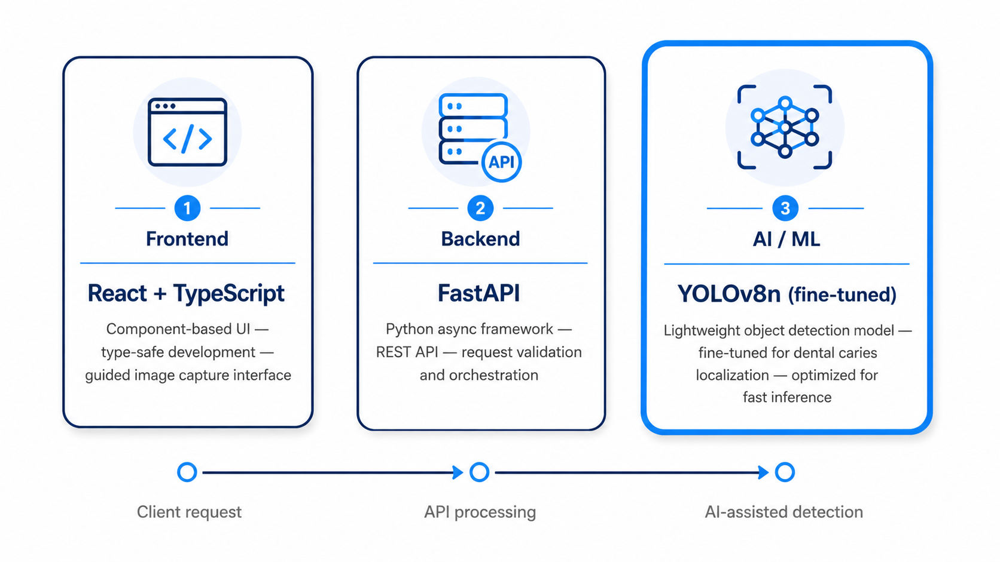

# SpotEarly Dental Screening

SpotEarly is a full-stack dental screening application that helps healthcare teams collect dental images, run AI-assisted caries detection, and review the results in a structured patient file.

The application is designed as a screening aid. It highlights image regions that may require professional review; it does not provide a medical diagnosis.

## 1. Project Overview

### The problem

Early signs of dental caries can be difficult to identify consistently during an initial screening, especially when several dental views must be collected and reviewed. Manual review can also make it difficult to preserve the relationship between a patient, a specific image angle, and the detected regions.

### The solution

SpotEarly combines:

- A guided workflow for collecting patient information.
- Camera capture and image upload for several dental views.
- An Ultralytics YOLO object-detection model trained for caries detection.
- Per-image bounding boxes and confidence scores.
- A patient file that preserves the result for every uploaded angle.
- A local dashboard for reviewing and saving screening records.

The model is executed by the backend. The frontend sends each selected image independently, then displays the returned detections on the corresponding image.

## 2. Main Features

- Patient registration with name, age, and identity fields.
- Upload or camera capture for:
  - Front bite
  - Upper arch
  - Lower arch
  - Left side
  - Right side
- No mandatory image angle: screening can start with any uploaded image.
- Multi-image analysis using the AI model.
- Colored detection boxes for multiple findings.
- Confidence percentage displayed beside each detection box.
- Per-image result sections showing the angle, image, detections, and confidence values.
- Patient file saving through browser local storage.
- Dashboard search and image review workflow.

## 3. System Architecture



The system is organized into three cooperating layers:

1. **Frontend:** A React and TypeScript interface guides image capture, upload, patient review, and result visualization.
2. **Backend:** A FastAPI service validates incoming images, exposes the REST API, and coordinates model inference.
3. **AI/ML:** The fine-tuned Ultralytics YOLO model in `backend/model/best.pt` detects possible caries regions and returns normalized bounding boxes with confidence scores.

The request flows from the frontend to the backend as a multipart image upload. After inference, the backend returns structured JSON. The frontend then draws each detection on the correct image and preserves the result for the patient file.

```text
User
  |
  v
React + Vite frontend
  |  multipart image upload
  v
FastAPI backend
  |  Ultralytics YOLO inference
  v
backend/model/best.pt
  |
  v
Normalized detection response
```

## 4. Important Files

### Backend

| File                                                 | Responsibility                                                         |
| ---------------------------------------------------- | ---------------------------------------------------------------------- |
| [backend/main.py](backend/main.py)                   | FastAPI application, model loading, validation, and inference endpoint |
| [backend/requirements.txt](backend/requirements.txt) | Python dependencies                                                    |
| [backend/model/best.pt](backend/model/best.pt)       | Trained YOLO model used in production inference                        |

### Frontend

| File                                                                                                             | Responsibility                                             |
| ---------------------------------------------------------------------------------------------------------------- | ---------------------------------------------------------- |
| [frontend/src/main.tsx](frontend/src/main.tsx)                                                                   | React application bootstrap                                |
| [frontend/src/App.tsx](frontend/src/App.tsx)                                                                     | Application routing                                        |
| [frontend/src/pages/NewScreening.tsx](frontend/src/pages/NewScreening.tsx)                                       | Patient intake, image collection, and multi-image analysis |
| [frontend/src/pages/PatientFile.tsx](frontend/src/pages/PatientFile.tsx)                                         | Per-image AI results, confidence values, notes, and saving |
| [frontend/src/pages/Dashboard.tsx](frontend/src/pages/Dashboard.tsx)                                             | Saved screening records and image review                   |
| [frontend/src/lib/detectionApi.ts](frontend/src/lib/detectionApi.ts)                                             | Frontend API client and response validation                |
| [frontend/src/components/screening/DetectionOverlay.tsx](frontend/src/components/screening/DetectionOverlay.tsx) | Image overlay and confidence labels                        |
| [frontend/src/components/screening/DetectionOverlay.css](frontend/src/components/screening/DetectionOverlay.css) | Detection box and confidence label styling                 |
| [frontend/src/pages/screeningTypes.ts](frontend/src/pages/screeningTypes.ts)                                     | Shared patient and screening record types                  |

### Model development

| File                                             | Responsibility                                                    |
| ------------------------------------------------ | ----------------------------------------------------------------- |
| [caries_detection.ipynb](caries_detection.ipynb) | Dataset audit, YOLO dataset preparation, training, and evaluation |

## 5. Requirements

- Windows, macOS, or Linux
- Python 3.10 or newer recommended
- Node.js 18 or newer recommended
- npm
- A trained model at `backend/model/best.pt`

## 6. Installation

### Backend installation on Windows

From the repository root:

```powershell
cd backend
python -m venv .venv
.\.venv\Scripts\Activate.ps1
python -m pip install --upgrade pip
pip install -r requirements.txt
```

If PowerShell blocks activation, run the backend with the virtual-environment executable directly:

```powershell
backend\.venv\Scripts\python.exe -m uvicorn backend.main:app --reload --host 0.0.0.0 --port 8000
```

### Backend installation on macOS or Linux

```bash
cd backend
python3 -m venv .venv
source .venv/bin/activate
python -m pip install --upgrade pip
pip install -r requirements.txt
```

### Frontend installation

```bash
cd frontend
npm install
```

## 7. Running the Application

Run the backend in one terminal:
```bash
git clone https://github.com/kassemabbassi/Connectathon-
```
```bash
cd backend
uvicorn main:app --reload --host 0.0.0.0 --port 8000
```

Run the frontend in a second terminal:

```bash
cd frontend
npm run dev
```

Open the URL printed by Vite, normally:

```text
http://localhost:5173
```

The backend API will normally be available at:

```text
http://localhost:8000
```


## 8. Typical User Workflow

1. Open **New screening**.
2. Enter the patient details.
3. Upload or capture one or more dental images.
4. Start the screening from any available angle.
5. Wait for the AI analysis to complete.
6. Review each image and its confidence values.
7. Add clinical notes if needed.
8. Save the patient file.
9. Review the saved record from the dashboard.

## 9. AI Request and Response

### Request flow

Each uploaded image is analyzed independently. The frontend converts the captured image into a file, sends it to the backend using `multipart/form-data`, and uses the response to render detections for that specific dental view.

Endpoint:

```http
POST http://localhost:8000/detect
Content-Type: multipart/form-data
```

The multipart field is named `file`.


### Response

The backend runs the YOLO model and returns the image dimensions plus one entry for every detected caries region:

```json
{
  "detections": [
    {
      "label": "caries",
      "confidence": 0.873,
      "x": 0.241,
      "y": 0.318,
      "width": 0.126,
      "height": 0.142
    }
  ],
  "image_width": 1280,
  "image_height": 960
}
```

Response fields:

| Field                         | Description                                |
| ----------------------------- | ------------------------------------------ |
| `detections`                  | List of detected regions                   |
| `label`                       | Model class name, currently `caries`       |
| `confidence`                  | Model confidence score between `0` and `1` |
| `x`, `y`                      | Normalized top-left coordinate of the box  |
| `width`, `height`             | Normalized dimensions of the box           |
| `image_width`, `image_height` | Original image dimensions in pixels        |

When no caries region is detected, the API returns an empty list:

```json
{
  "detections": [],
  "image_width": 1280,
  "image_height": 960
}
```

The frontend uses the normalized coordinates to draw the box on the corresponding uploaded image. Each dental angle is processed separately, so the result for an upper-arch image is never mixed with the result for a lateral image.


